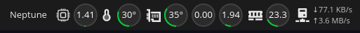
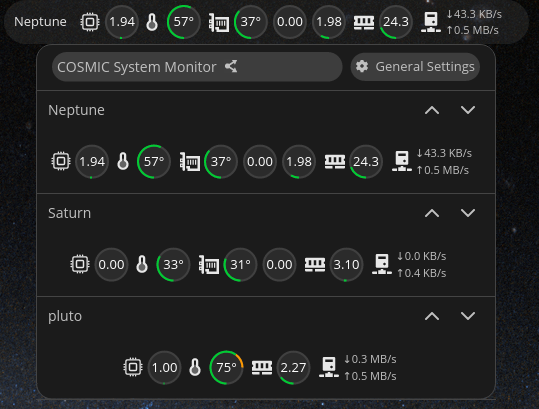
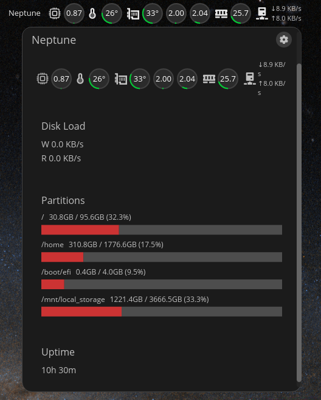

# Network System Monitor

> Monitor every Linux machine on your network — CPU, memory, GPU, temperature, disk, and network — from a single COSMIC panel applet.



---

## What it does

Install the applet once on your desktop. Install a tiny systemd service on each remote machine. That's it — live metrics from all your machines appear directly in the COSMIC panel, with a click-to-expand detail view.




---

## Features

- **Multi-machine panel** — all your machines in one place, the top machine always visible in the panel bar
- **Per-machine sensor config** — choose exactly which charts appear in each machine's row via the gear icon
- **Detailed view** — click any machine to see all metrics not shown in the row (partitions, swap, GPU details, uptime)
- **Threshold ring charts** — green → orange → red as values climb
- **Encrypted UDP** — ChaCha20-Poly1305 AEAD with TOFU pairing; no configuration needed beyond running the installer
- **COSMIC-native** — respects your theme (dark/light), panel orientation (horizontal/vertical), and panel spacing
- **Low overhead** — one UDP packet per second per machine; no persistent connections

**Metrics collected:** CPU load · CPU temperature · RAM usage · Swap · Network throughput · Disk I/O · Disk partitions · GPU load · VRAM usage · GPU temperature · Uptime

---

## Requirements

| Component | Where | Requirement |
|-----------|-------|-------------|
| `cosmic-applet` | Desktop | COSMIC desktop (Pop!_OS 24.04 or any COSMIC distro) |
| `nmd-service` | Each remote machine | Linux, systemd, Rust toolchain |

Both machines must be on the same local network. All communication is over UDP port 51057 (configurable).

---

## Installation

### One-line installer (recommended)

Run this on **every machine** — desktop and remote alike. The script asks what to install (sender / receiver / both) and whether to use a pre-built binary or compile from source. If building from source it installs Rust automatically.

```bash
curl -fsSL https://raw.githubusercontent.com/me60732/network-system-monitor/main/install.sh | sudo bash
```

> **Note:** use `curl … | sudo bash`, not `sudo curl … | bash` — the pipe spawns a new shell, so `sudo` must be on `bash` or the script won't have root.

What the script does:
1. Asks **what to install** — `sender` (nmd-service, for remote machines), `receiver` (cosmic-applet, for your desktop), or `both`
2. Asks **how to install** — pre-built binary from GitHub Releases, or compile from source
3. If compiling from source, installs Rust via `rustup` if it isn't already present
4. Installs the chosen component and (for the sender) configures `/etc/nmd/config.toml`

After installing on your desktop, right-click the COSMIC panel → **Add Applet** → **Network System Monitor**.

On first contact from a remote machine the applet shows a **pairing request** — accept it. The X25519 key exchange happens automatically over TCP; after that all traffic is encrypted UDP.

---

## Firewall

If your desktop machine has a firewall, open port 51057 for both protocols:

```bash
# firewalld (COSMIC / Fedora)
sudo firewall-cmd --permanent --add-port=51057/udp
sudo firewall-cmd --permanent --add-port=51057/tcp
sudo firewall-cmd --reload

# ufw (Ubuntu / Debian)
sudo ufw allow 51057/udp
sudo ufw allow 51057/tcp
```

---

## How it works

```
Remote machine (each one)
  └─ nmd-service (systemd)
       Collects: CPU · RAM · disk · network · GPU · temperature
       Encrypts with ChaCha20-Poly1305 (per-machine ECDH key)
       Sends: UDP → desktop:51057 every 1 s

Desktop machine
  └─ cosmic-applet
       Receives UDP packets, verifies AEAD tag, updates live metrics
       Renders panel bar widget + popup detail view
       Manages pairing, config, and per-machine sensor display
```

### Security

- **Encryption:** ChaCha20-Poly1305 AEAD — confidentiality + authenticity in one operation
- **Key exchange:** TOFU pairing via TCP; sender's Ed25519 identity derives an X25519 key, ECDH with the receiver's static key produces a unique per-machine cipher key
- **Replay protection:** timestamp freshness (< 10 s window) + monotonic sequence counter per session

---

## Configuration

Most configuration is done from within the applet, but refresh rate requires editing the service config file.

| Setting | Where |
|---------|-------|
| Font, spacing, content order | Popup → **General Settings** |
| Refresh rate | Edit `/etc/nmd/config.toml` on each remote machine |
| Which sensors appear in a machine's row | Machine detail view → **⚙ gear icon** |
| Machine display order | Machine list → **↑ ↓ buttons** (session only) |

The applet config is stored at `~/.config/cosmic-applet/config.toml`.  
The service config lives at `/etc/nmd/config.toml` on each remote machine.

---

## Project layout

```
network-system-monitor/
├── metrics-core/          # Shared library: sysinfo + procfs metric collection
├── nmd-service/           # Remote systemd service (binary sent to each machine)
│   └── install-scripts/   # install.sh · uninstall.sh
├── cosmic-applet/         # COSMIC panel applet (desktop binary)
│   └── install-local.sh   # Build + install applet locally
└── docs/                  # Pairing system spec, screenshots
```

---

## License

This project is licensed under the GNU General Public License v3.0.

See the [LICENSE](LICENSE) file for details.
