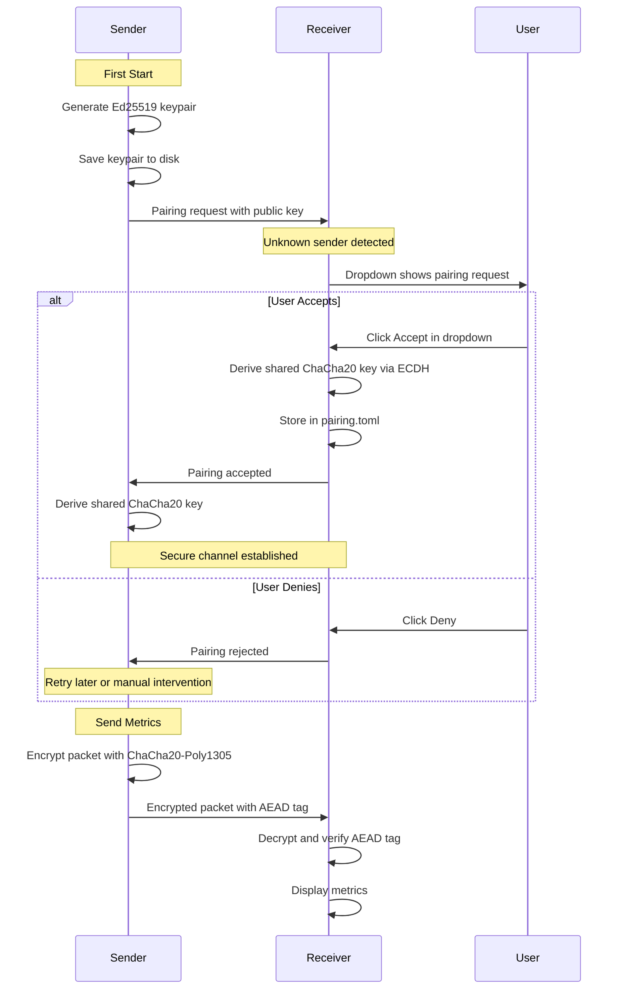

# Pairing System v1.0 — Hybrid ChaCha20-Poly1305 AEAD Architecture

**Date:** 2026-08-28  
**Status:** Phase 1 Complete (crypto), Phase 2 In Progress (UI)  
**Breaking Change:** Yes — incompatible with HMAC-based versions

---

## Executive Summary

Network System Monitor v1.0 replaces symmetric HMAC-SHA256 authentication with asymmetric Ed25519 + ChaCha20-Poly1305 AEAD encryption. This provides:

- **Confidentiality**: Metrics encrypted over the network (not readable via packet capture)
- **Authentication**: Per-machine Ed25519 keypairs prevent spoofing
- **Zero-config senders**: Automatic keypair generation, no manual secret distribution
- **Bluetooth-style pairing**: Visual approval flow for new machines (Trust-On-First-Use)
- **Resilience**: Stateless UDP survives independent machine reboots

---

## Architecture Decision

### Why AEAD Instead of HMAC?

| Factor | HMAC-SHA256 (Old) | ChaCha20-Poly1305 (New) |
|--------|-------------------|-------------------------|
| **Confidentiality** | ❌ Plaintext metrics | ✅ Encrypted |
| **Authentication** | ✅ Yes | ✅ Yes |
| **Key management** | ❌ Shared 32-byte secret | ✅ Per-machine keypairs |
| **Deployment** | ❌ Manual key copy | ✅ Auto-generate |
| **Compromise isolation** | ❌ One key = all senders | ✅ Only one sender |
| **Tag size** | 32 bytes (HMAC) | 16 bytes (Poly1305) |
| **Performance** | ~10μs | ~15μs |

**Decisive factor**: Breaking change for v1.0 anyway → do complete security from the start, not piecemeal upgrades.

### Why Not SSH Tunneling?

SSH tunnels would provide battle-tested security but require:
- ❌ SSH daemon on receiver
- ❌ Connection state management (N tunnels for N senders)
- ❌ Auto-reconnect logic on reboot
- ❌ Systemd unit complexity (tunnel health checks)

**For a monitoring system where machines reboot independently**, stateless UDP with AEAD is architecturally superior:
- ✅ Sender reboot → generate keypair → pairing request → operational
- ✅ Receiver reboot → bind socket → read pairing.toml → ready
- ✅ Zero connection state to maintain
- ✅ Failure isolation (one sender down ≠ all affected)

---

## Cryptographic Flow

### 1. Key Generation (Both Sender & Receiver)

```rust
// On first start:
let keypair = Ed25519Keypair::generate();
save_to_file("~/.config/nmd/keypair.key", keypair, 0o600);

// Subsequent starts:
let keypair = load_from_file("~/.config/nmd/keypair.key");
```

**File format**: 64 bytes (32 private + 32 public), `0600` permissions

### 2. Pairing Ceremony (ECDH Key Exchange)

```
Sender                          Receiver
  |                                 |
  |--- UDP: [pairing_request] ---->|  (includes sender public key)
  |                                 |
  |                         User sees notification:
  |                         "test-machine wants to connect"
  |                         [Accept] [Reject]
  |                                 |
  |<--- (if Accept) ECDH --------->|  (derive shared ChaCha20 key)
  |                                 |
  |     Store in pairing.toml      |
  |                                 |
  |=== ENCRYPTED CHANNEL READY ===|
```

**Shared key derivation** (X25519 ECDH):
```rust
let shared_secret = x25519(sender_private, receiver_public);
let chacha_key: [u8; 32] = derive_key(shared_secret);
```

### 3. Packet Transmission

**Sender** (nmd-service):
```rust
// 1. Fill packet with metrics
let mut packet = MetricPacket {
    sender_session_id: self.session_id,
    sequence: self.sequence_counter.fetch_add(1),
    timestamp: now(),
    cpu: collect_cpu(),
    // ... other metrics
};

// 2. Serialize with rkyv (no hmac_tag field)
let plaintext = rkyv::to_bytes(&packet)?;

// 3. Encrypt with ChaCha20-Poly1305
let nonce = random_nonce(); // 12 bytes
let ciphertext_with_tag = cipher.encrypt(&nonce, plaintext.as_ref())?;

// 4. Wire format: [nonce][ciphertext+tag]
let mut wire_buffer = Vec::with_capacity(12 + ciphertext_with_tag.len());
wire_buffer.extend_from_slice(&nonce);
wire_buffer.extend_from_slice(&ciphertext_with_tag);

// 5. Send via UDP
socket.send_to(&wire_buffer, dest)?;
```

**Receiver** (cosmic-applet):
```rust
// 1. Receive UDP packet
let mut buf = [0u8; MAX_PACKET_SIZE];
let (len, src) = socket.recv_from(&mut buf)?;

// 2. Parse wire format
let nonce = &buf[..12];
let ciphertext_with_tag = &buf[12..len];

// 3. Lookup shared key for this sender
let shared_key = pairing_manager.get_key(&src)?;

// 4. Decrypt + verify AEAD tag
let plaintext = cipher.decrypt(nonce, ciphertext_with_tag)?;

// 5. Deserialize with rkyv
let packet = rkyv::access::<ArchivedMetricPacket>(&plaintext)?;

// 6. Proceed with timestamp/sequence checks
verify_timestamp(packet.timestamp)?;
verify_sequence(packet.machine_id, packet.sequence)?;

// 7. Display metrics
update_ui(packet);
```

**Benefits:**
- ✅ Per-machine keypairs (isolation)
- ✅ Zero-config senders (auto-generate)
- ✅ Confidentiality (encrypted metrics)
- ✅ Authentication + integrity (Poly1305 AEAD tag)
- ✅ Visual approval (trust-on-first-use)

---

## Wire Format

### Packet Structure Changes

**Remove from MetricPacket:**
```rust
pub hmac_tag: [u8; 32],  // DELETE THIS FIELD
```

**New wire format:**
```
[ChaCha20-encrypted rkyv serialized packet][16-byte Poly1305 tag]
                    ↑                                  ↑
              confidential                      authenticated
```

The AEAD tag is **appended** after encryption, not embedded in the struct. ChaCha20-Poly1305 encrypts the serialized packet and computes the authentication tag in a single operation.

---

## Pairing Flow (Trust-On-First-Use)



### Dropdown Menu UX Specification

**CRITICAL UX REQUIREMENT:**

The receiver's dropdown menu (top-right panel selector) has **dual mode** behavior:

#### Mode 1: Normal Operation (No Pending Pairings)
- Dropdown shows standard menu items:
  - Settings
  - About
  - Machine selection
  - etc.

#### Mode 2: Pairing Request Pending
When one or more unknown senders attempt to connect:

1. **Dropdown hijacked by pairing list**
2. **Each pending machine shows:**
   ```
   ┌──────────────────────────────────────┐
   │ 🔌 test-machine (127.0.0.1)         │
   │    [Accept]  [Deny]                 │
   ├──────────────────────────────────────┤
   │ 🔌 server-alpha (192.168.1.50)      │
   │    [Accept]  [Deny]                 │
   └──────────────────────────────────────┘
   ```
3. **User action:**
   - **Accept** → ECDH key derivation → store pairing → item removed from list
   - **Deny** → packet dropped → item removed from list
4. **When list empty** → dropdown returns to normal operation

**Implementation Notes:**
- Pairing requests queued in-memory (not persisted across receiver restarts)
- Duplicate requests from same machine_id coalesced (show once)
- Timeout: pairing request expires after 60 seconds if no user action
- Visual indicator: badge/notification on dropdown when requests pending

---

## File Modifications

### Dependencies

**nmd-service/Cargo.toml:**
```toml
ed25519-dalek = "2.1"           # Ed25519 keypairs + ECDH
chacha20poly1305 = "0.10"       # AEAD encryption
rand = "0.8"                    # Random key generation

# REMOVE:
hmac = { workspace = true }     # DELETE
sha2 = { workspace = true }     # DELETE
```

**cosmic-applet/Cargo.toml:**
```toml
ed25519-dalek = "2.1"           # ECDH key derivation
chacha20poly1305 = "0.10"       # AEAD decryption

# REMOVE:
hmac = { workspace = true }     # DELETE
sha2 = { workspace = true }     # DELETE
subtle = { version = "2" }      # DELETE
crypto-common = { version = "0.2" }  # DELETE
```

### Code Changes

| File | Change | Description |
|------|--------|-------------|
| `nmd-service/src/packet.rs` | **REMOVE** | Delete `pub hmac_tag: [u8; 32]` field from MetricPacket |
| `nmd-service/src/udp_sender.rs` | **REFACTOR** | Replace HMAC signing with ChaCha20-Poly1305 encryption |
| `cosmic-applet/src/network/udp_receiver.rs` | **REFACTOR** | Replace HMAC verification with AEAD decryption |
| `cosmic-applet/src/pairing_manager.rs` | **NEW** | Pairing state storage + ECDH key derivation |
| `cosmic-applet/src/pairing_ui.rs` | **NEW** | Dropdown menu hijack logic for pairing requests |

---

## Implementation Phases

### Phase 1: Core Cryptography (6 days)

**Goal:** Replace HMAC with ChaCha20-Poly1305 AEAD

**Tasks:**
1. Add `ed25519-dalek` and `chacha20poly1305` to both Cargo.toml files
2. Remove `hmac_tag` field from `nmd-service/src/packet.rs`
3. Implement ECDH key derivation from Ed25519 keypairs
4. **Sender (udp_sender.rs):**
   - Load or generate Ed25519 keypair at `~/.config/nmd/keypair.key`
   - Derive shared ChaCha20 key (initially hardcoded for testing)
   - Encrypt serialized packet with ChaCha20-Poly1305
   - Append 16-byte Poly1305 tag to buffer
   - Send encrypted packet
5. **Receiver (udp_receiver.rs):**
   - Split incoming buffer: `[ciphertext][16-byte tag]`
   - Lookup sender's shared key (initially hardcoded)
   - Decrypt with ChaCha20-Poly1305 and verify AEAD tag
   - Deserialize decrypted packet

**Deliverable:** Sender encrypts, receiver decrypts successfully (no pairing UI yet; hardcoded shared key for testing)

**Testing:**
- Unit test: encrypt/decrypt roundtrip
- Integration test: send packet with 5-sender script, verify decryption
- Performance: measure AEAD overhead (<20μs target)

---

### Phase 2: Pairing Logic (5 days)

**Goal:** Implement TOFU detection and pairing state management

**Tasks:**
1. **Create `cosmic-applet/src/pairing_manager.rs`:**
   ```rust
   pub struct PairingManager {
       paired_machines: HashMap<String, PairingInfo>,
       config_path: PathBuf,
   }
   
   pub struct PairingInfo {
       machine_id: String,
       shared_key: [u8; 32],  // ChaCha20 key derived via ECDH
       paired_at: DateTime<Utc>,
       host: String,
   }
   
   impl PairingManager {
       pub fn is_paired(&self, machine_id: &str) -> bool;
       pub fn get_key(&self, machine_id: &str) -> Option<&[u8; 32]>;
       pub fn add_pairing(&mut self, machine_id: String, sender_pubkey: &[u8; 32]) -> Result<()>;
       pub fn remove_pairing(&mut self, machine_id: &str) -> Result<()>;
   }
   ```

2. **Implement `pairing.toml` storage:**
   ```toml
   [[paired_machines]]
   machine_id = "test-machine"
   shared_key = "a1b2c3d4..."  # 32-byte ChaCha20 key (hex-encoded)
   paired_at = "2026-08-28T14:32:00Z"
   host = "127.0.0.1"
   ```
   - Load on receiver startup
   - Persist on pairing add/remove
   - File permissions: `0600` (owner read/write only)

3. **TOFU detection in udp_receiver.rs:**
   - On packet receive: extract `machine_id` from decrypted packet
   - Check `pairing_manager.is_paired(machine_id)`
   - If **unknown** → emit `PairingRequest` event to UI layer
   - If **known** → lookup key and decrypt

4. **Pairing request queue:**
   - In-memory `Vec<PairingRequest>` in AppState
   - Deduplicate by machine_id
   - 60-second timeout (auto-remove if no action)

**Deliverable:** Backend detects unknown senders and emits pairing events (UI not yet wired)

**Testing:**
- Unit test: pairing.toml serialize/deserialize
- Unit test: TOFU detection logic
- Integration test: start unknown sender → verify pairing event emitted

---

### Phase 3: UI Integration (4 days)

**Goal:** Wire pairing events to dropdown menu

**Tasks:**
1. **Create `cosmic-applet/src/pairing_ui.rs`:**
   - Dropdown mode switch: `enum DropdownMode { Normal, PairingRequests }`
   - Render pairing request list when `pending_pairings.len() > 0`
   - Accept button handler: calls `pairing_manager.add_pairing()` + derives ECDH key
   - Deny button handler: removes from queue

2. **Dropdown hijack implementation:**
   ```rust
   fn dropdown_content(&self) -> Element<Message> {
       if !self.pending_pairings.is_empty() {
           // Mode 2: Show pairing requests
           column![
               text("New machines requesting connection:"),
               ...self.pending_pairings.iter().map(|req| {
                   row![
                       text(format!("🔌 {} ({})", req.machine_id, req.host)),
                       button("Accept").on_press(Message::AcceptPairing(req.clone())),
                       button("Deny").on_press(Message::DenyPairing(req.machine_id.clone())),
                   ]
               })
           ].into()
       } else {
           // Mode 1: Normal dropdown menu
           column![
               button("Settings"),
               button("About"),
               // ... standard menu items
           ].into()
       }
   }
   ```

3. **Visual notification:**
   - Badge on dropdown button showing `pending_pairings.len()`
   - Icon change: `⚙️` (normal) → `🔔` (pairing requests pending)

4. **Accept flow:**
   - User clicks Accept → extract sender's Ed25519 public key from initial packet
   - Receiver derives ECDH shared secret: `receiver_privkey + sender_pubkey → shared_key`
   - Store in `pairing.toml` via `pairing_manager.add_pairing()`
   - Remove from `pending_pairings` queue
   - Future packets from that sender decrypt successfully

5. **Deny flow:**
   - Remove from `pending_pairings` queue
   - Future packets from that sender dropped silently (no pairing entry)

**Deliverable:** Full Bluetooth-style pairing UX operational

**Testing:**
- Manual test: start unknown sender → dropdown shows request → accept → metrics flow
- Manual test: deny request → packets dropped
- Manual test: 3 simultaneous unknown senders → all shown in dropdown
- Edge case: restart receiver while pairing requests pending → queue cleared (acceptable)

---

## Configuration Files

### Sender: `~/.config/nmd/keypair.key`
```
# Ed25519 keypair (64 bytes: 32 private + 32 public)
# Generated automatically on first start
# Used for ECDH key derivation with receiver
# Permissions: 0600 (owner read/write only)
[binary file]
```

**Generation:**
```rust
use ed25519_dalek::SigningKey;
use rand::rngs::OsRng;

let signing_key = SigningKey::generate(&mut OsRng);
let keypair_bytes = signing_key.to_keypair_bytes(); // 64 bytes
std::fs::write("~/.config/nmd/keypair.key", &keypair_bytes)?;
```

### Receiver: `~/.config/cosmic-applet/pairing.toml`
```toml
# Machine pairing registry
# Format: machine_id → shared ChaCha20 key

[[paired_machines]]
machine_id = "test-machine"
shared_key = "a1b2c3d4e5f6..."  # 32-byte key (64 hex chars)
paired_at = "2026-08-28T14:32:00Z"
host = "127.0.0.1"

[[paired_machines]]
machine_id = "server-alpha"
shared_key = "1a2b3c4d5e6f..."
paired_at = "2026-08-27T09:15:00Z"
host = "192.168.1.50"
```

**Permissions:** `0600` (critical — contains shared encryption keys)

---

## Security Properties

| Property | HMAC (Current) | ChaCha20-Poly1305 (New) | Notes |
|----------|---------------|-------------------------|-------|
| **Authentication** | ✅ Yes | ✅ Yes | Proves sender identity |
| **Integrity** | ✅ Yes | ✅ Yes | Detects tampering |
| **Confidentiality** | ❌ No | ✅ Yes | **NEW:** Metrics encrypted on wire |
| **Per-machine keys** | ❌ Shared secret | ✅ Unique keypairs | One compromise ≠ all compromised |
| **Zero-config** | ❌ Manual copy | ✅ Auto-generate | Sender generates keypair on first start |
| **Compromise isolation** | ❌ All affected | ✅ Only one sender | Per-machine key isolation |
| **User approval** | ❌ Silent | ✅ Visual dropdown | TOFU approval flow |
| **Tag/AEAD size** | 32 bytes | 16 bytes | Smaller overhead |
| **Performance** | ~10μs | ~15μs | Minimal increase |

### Why ChaCha20-Poly1305?
- **Speed:** Faster than AES-GCM on CPUs without AES-NI instructions
- **Security:** RFC 8439 standard, used by WireGuard, TLS 1.3, OpenSSH
- **Simplicity:** Single-operation AEAD (encrypt + authenticate together)
- **Battle-tested:** Years of production use in critical infrastructure

---

## Testing Strategy

### Unit Tests

**`nmd-service/src/udp_sender.rs`:**
```rust
#[test]
fn test_keypair_generation() {
    // Verify keypair saved with 0600 perms
}

#[test]
fn test_encryption_roundtrip() {
    // Encrypt packet → decrypt → verify matches original
}

#[test]
fn test_invalid_tag() {
    // Tampered ciphertext → decryption fails
}
```

**`cosmic-applet/src/pairing_manager.rs`:**
```rust
#[test]
fn test_pairing_storage() {
    // Add pairing → save to disk → reload → verify persisted
}

#[test]
fn test_ecdh_key_derivation() {
    // Sender pubkey + receiver privkey → shared secret matches
}
```

**`cosmic-applet/src/network/udp_receiver.rs`:**
```rust
#[test]
fn test_unknown_sender_detection() {
    // Packet from unknown machine_id → pairing request emitted
}

#[test]
fn test_paired_sender() {
    // Packet from known machine_id → decryption succeeds
}
```

### Integration Tests

**5-Sender Stress Test:**
```bash
# Update test-5-senders.sh to generate unique Ed25519 keypairs for each sender
./test-5-senders.sh setup   # Generate 5 keypairs
./test-5-senders.sh senders # Start all 5 senders
./test-5-senders.sh receiver # Start receiver (shows 5 pairing requests)

# Manual verification:
# 1. Dropdown shows 5 pairing requests
# 2. Accept all → all metrics flow correctly
# 3. Verify 0 packet loss, 0 sequence gaps
# 4. Performance: <20μs encryption overhead per packet
```

**Pairing Flow Test:**
```bash
# 1. Start fresh sender (no keypair exists)
# 2. Sender generates keypair, sends pairing request
# 3. Receiver shows dropdown notification
# 4. Accept → pairing.toml updated
# 5. Metrics flow correctly
# 6. Restart sender → uses existing keypair → no re-pairing needed
# 7. Restart receiver → loads pairing.toml → metrics flow immediately
```

### Performance Benchmarks

**Target metrics:**
- Encryption: <15μs per packet (vs ~10μs HMAC)
- Decryption: <15μs per packet
- ECDH key derivation: <100μs (one-time per pairing)
- Memory overhead: +64 bytes per paired machine (pairing.toml)

**Benchmark harness:**
```bash
cd nmd-service
cargo bench --bench packet_bench
# Verify aggregation + encryption < 2ms total (1ms aggregation + <1ms encryption)
```

---

## Migration Path

### Breaking Change Notice

**Version 1.0 will NOT be compatible with pre-1.0 HMAC senders.**

This is acceptable for a 1.0 release. Clean break, modern crypto from day 1.

### Upgrade Procedure

**For users upgrading from 0.x → 1.0:**

1. **Stop all services:**
   ```bash
   systemctl stop nmd-service
   ```

2. **Update binaries:**
   ```bash
   cargo build --release
   sudo cp target/release/nmd-service /usr/local/bin/
   sudo cp target/release/cosmic-applet ~/.local/bin/
   ```

3. **Clean old secrets:**
   ```bash
   sudo rm /etc/nmd/secret.key  # Old HMAC secret (no longer used)
   ```

4. **Start sender (generates keypair automatically):**
   ```bash
   systemctl start nmd-service
   ```

5. **Start receiver:**
   ```bash
   cosmic-applet
   ```

6. **Pair each sender:**
   - Receiver dropdown shows pairing requests
   - Click "Accept" for each machine
   - Verify metrics flowing

**First-time users:** No migration needed — pairing happens automatically on first connection.

---

## Future Enhancements

### Version 1.1: Pairing UX Improvements
- **QR code pairing:** Sender displays QR with public key, receiver scans to pair (no dropdown interaction)
- **Bulk approval:** "Accept all from subnet 192.168.1.0/24"
- **Expiring pairings:** Auto-remove machines inactive for 90+ days
- **Key rotation:** Periodic re-derivation of shared ChaCha20 keys (every 30 days)
- **Pairing history:** Log of all pairing events (timestamp, user action, machine_id)

### Version 2.0: Advanced Security
- **Forward secrecy:** Ephemeral ECDH keys per session (new shared key every N packets)
- **Multi-receiver:** Sender encrypts for multiple receivers simultaneously
- **Certificate pinning:** Optional manual fingerprint verification (beyond TOFU)
- **Hardware security module (HSM):** Store Ed25519 private keys in TPM/Yubikey
- **Audit logging:** Cryptographic log of all pairing/unpairing events

---

## Appendix: Crypto Implementation Notes

### ECDH Key Derivation (X25519)

Ed25519 keys can be converted to X25519 for Diffie-Hellman:

```rust
use ed25519_dalek::{SigningKey, VerifyingKey};
use x25519_dalek::{PublicKey as X25519PublicKey, StaticSecret as X25519Secret};

// Sender side:
let sender_signing_key = SigningKey::generate(&mut OsRng);
let sender_x25519_secret = X25519Secret::from(sender_signing_key.to_bytes());
let sender_x25519_public = X25519PublicKey::from(&sender_x25519_secret);

// Receiver side (receives sender_x25519_public):
let receiver_signing_key = SigningKey::generate(&mut OsRng);
let receiver_x25519_secret = X25519Secret::from(receiver_signing_key.to_bytes());

// Both sides compute same shared secret:
let shared_secret = receiver_x25519_secret.diffie_hellman(&sender_x25519_public);
// shared_secret.as_bytes() → 32-byte ChaCha20 key
```

### ChaCha20-Poly1305 Encryption

```rust
use chacha20poly1305::{
    aead::{Aead, AeadCore, KeyInit},
    ChaCha20Poly1305, Nonce
};

// Encrypt:
let cipher = ChaCha20Poly1305::new(&shared_key.into());
let nonce = ChaCha20Poly1305::generate_nonce(&mut OsRng); // 12 bytes
let ciphertext = cipher.encrypt(&nonce, plaintext.as_ref())
    .expect("encryption failure");
// ciphertext = [encrypted_data][16-byte Poly1305 tag]

// Decrypt:
let plaintext = cipher.decrypt(&nonce, ciphertext.as_ref())
    .expect("decryption failure");
```

**Nonce handling:** Include nonce in packet header (12 bytes before ciphertext). Nonce MUST be unique per packet (use counter or random).

### Replay Protection

Continue using existing sequence numbers + timestamps:
- Sequence: monotonic counter per sender (prevents replay)
- Timestamp: freshness check (<10s window)
- Session ID: random on sender restart (prevents sequence lockout)

These fields are **encrypted** in the new design (unlike HMAC where they were plaintext).

---

## Success Criteria

**Phase 1 Complete:**
- [ ] Sender encrypts packets with ChaCha20-Poly1305
- [ ] Receiver decrypts successfully with hardcoded shared key
- [ ] Benchmark: <20μs encryption+decryption overhead
- [ ] All existing tests pass with encrypted packets

**Phase 2 Complete:**
- [ ] `pairing_manager.rs` implemented with TOFU detection
- [ ] `pairing.toml` loads/saves correctly
- [ ] Unknown sender triggers pairing request event
- [ ] Known sender decrypts without pairing prompt

**Phase 3 Complete:**
- [ ] Dropdown menu hijacked by pairing requests
- [ ] Accept button completes ECDH key derivation
- [ ] Deny button removes pairing request
- [ ] Badge shows pending pairing count
- [ ] 5-sender stress test: all pair successfully

**Production Ready:**
- [ ] Zero packet loss in 5-sender 24-hour stress test
- [ ] Performance: <2ms end-to-end latency (aggregation + encryption)
- [ ] Security audit: Worf reviews crypto implementation
- [ ] Documentation complete
- [ ] Migration guide tested with upgrade from 0.x

---

## References

- **RFC 8439:** ChaCha20-Poly1305 AEAD specification
- **RFC 7748:** Elliptic Curves for Security (X25519)
- **WireGuard whitepaper:** Noise protocol framework with ChaCha20-Poly1305
- **ed25519-dalek docs:** https://docs.rs/ed25519-dalek/latest/
- **chacha20poly1305 docs:** https://docs.rs/chacha20poly1305/latest/

---

**Document Version:** 1.0  
**Last Updated:** 2026-08-28  
**Next Review:** After Phase 1 completion (Geordi's report)
